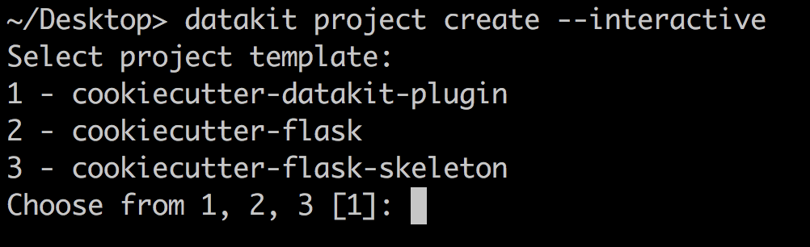

Usage
=====

Choose or create a template
~~~~~~~~~~~~~~~~~~~~~~~~~~~

`datakit-project` relies on the Cookiecutter_ library to generate project
templates from local git repositories as well as repositories hosted on Github.

You can `create your own Cookiecutter template`_ or use and adapt one of the `many Cookiecutters`_
created by the open source community.

.. _create-your-first-project:

Create your first project
~~~~~~~~~~~~~~~~~~~~~~~~~

Once you've created or chosen a Cookiecutter template, you're ready to create a
project using this library.

There are a few ways to create a project from a template::

    # From a local project
    $ datakit project create --template /local/path/to/cookiecutter-basic-project

    # From Github
    $ datakit project create --template https://github.com/associatedpress/cookiecutter-basic-project.git

    # From Github, but using an alias (less typing! WOOT!)
    $ datakit project create --template gh:associatedpress/cookiecutter-basic-project

When you create a project, you will be prompted on the command-line for a series
of information. Fill in the info or hit *return* to accept defaults, as appropriate.

The project will be generated in the same directory where the command was invoked.

.. _saving-keystrokes:

Saving keystrokes
~~~~~~~~~~~~~~~~~

Once you've installed one or more templates, creating new projects using those templates becomes
even easier.

The simplest method involves invoking ``create`` without any flags. This will automatically invoke the 
the :ref:`default-template`::

   $ datakit project create

.. note:: See the :ref:`default-template` docs to learn how to change the default template.

You can also create new projects by specifying the name of a template, *without having to reference
the Github URL or full path* to a local repo::

    $ datakit project create --template cookiecutter-some-other-project

To get a refresher on which templates are installed, use the command for :ref:`templates-command`::

   $ datakit project templates

.. _interactive-template-selection:

Interactive template selection
~~~~~~~~~~~~~~~~~~~~~~~~~~~~~~

Users with multiple templates installed can interactively choose a template for a new project:

.. _Cookiecutter: https://cookiecutter.readthedocs.io/en/latest/
.. _create your own Cookiecutter template: https://cookiecutter.readthedocs.io/en/latest/first_steps.html
.. _many Cookiecutters: https://cookiecutter.readthedocs.io/en/latest/readme.html#available-cookiecutters
